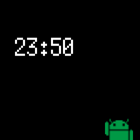

#  PixelWatchface
Pixelized watchface for Android Wear.

## Get started
1. Make your Android wear developer mode.
2. Connect it to your machine.
3. Open this project with Android Studio.
4. Run 'wear'.
